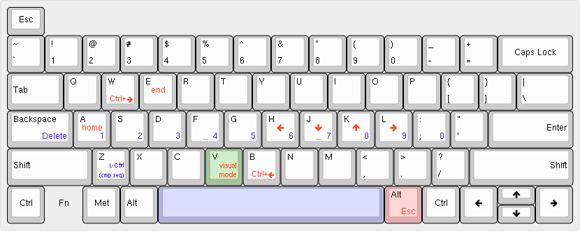

# Vim-like keyboard configuration with numbers on the home row and sane design choices

## Vim-like features
### Double taping and Holding `Right Alt` makes
- `hjkl` keys arrows (like in Vim normal mode).
- `b` and `w` `Ctrl+left` and `Ctrl+right`.
#### _Visual mode_
- `v` for entering _visual mode_.

After that every available movements is pressed with shift automatically which makes a selection **(at least in most GUIs)**.
#### Bash-like keys
- `a` for home.
- `e` for end.
## Numbers on the home row
- Hold space and the home row will be number row.
- Holding shift with space naturally makes it like holding shift and pressing keys on number row **(TL;DR `Space+Shift+a`=`Shift+1`=`!`)**.
## Some sane design choices
- `Backspace` and `Caps Lock` are reversed
	- I believe this is the stupidest design choice ever made in the history of electronic keyboards.
- Double tap `Right Alt` is `Escape`.
	- I do not know why did anyone think that putting key as essential as `Esc` at the end of the keyboard.
	- I used to have it one tap to escape and double tap to the _vim-like mode_ but I lost the ability to use `Right Alt`. So, I replaced it with this, not so much comfortable, configuration.
## Other
- Holding space also access:
	- `Delete` in place of `Backspace` (which was `Caps Lock`).
	- `z` is `Left Ctrl` which is the ***compose key***.
		- I use it with `setxkbmap` command for Xorg, `setxkbmap -option compose:lctrl`, this command is in `~/.xinitrc`.
### Things to note
- The `Function` key works only on hardware level which means it can not be used through any kind of software ([read this](https://github.com/kmonad/kmonad/blob/master/doc/faq.md#q-why-cant-i-remap-the-fn-key-on-my-laptop)).
- Thanks to `fallthrough` option I do not have to write all of my keyboard's keys. Therefore, only the keys which may be important are written in the configuration and, thus, in the image above.
